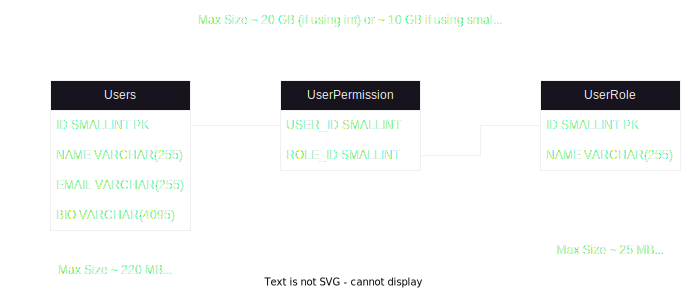

# Application User Management Admin Panel
## Requirements: 
### Functional
The system must have an API | User Interface to manipulate user roles - it should be able to provide CRUD operation on the user's roles. Users should have a name, email and a bio.
### Non Functional
The system supports up to 50000 users and 50000 roles.
The system should be able to return a result withing 50ms

## Model Design

## Analysis
- We can store the data in a database. The DB can be relational or a key-value type (like DynamoDB). If all users do a read request at once a single db instance should be able to handle about 50000 rows of data per second and the key-value db should take about twice as much. At high loads this may be insufficient to get below the 50ms requirement.
- Based on the data size analysis, the entire DB can be stored in memory of the application since the entire model is about 10GBs (this should be a concern only if we're looking for the cheapest price of this particular service). The instance RAM in this case should preferably be at least 12 GBs.
- We may need a distributed cache service like Redis or Memcached - for each user we can keep a list of all relevant roles, so the maximum key-value pairs we can have is up to 50000 entries.

## App Design

## Workflow
1. User creates a Restful CRUD request to the app
2. App is load balanced for redundancy, so the user hits the load balancer first
3. The app gets the roles from Redis 
4. If permissions are not available -> read from the db and put into Redis cache
5. Modify the permissions in Redis (in case of CUD request)
6. Put the change in a queue that will update the db (in case of a CUD request)
7. Return response to the user

## Conclusion 
The app response time should now be less than 50ms in the cases where the load is less than 12500 requests per second (Redis handles about 250000 reads in one second so 12500 / 250000 => 50ms). This is 25% of the entire user base! The conclusion is based on the assumption that the network latency is not taken into account. If needed the application can have redundancy on all levels so that it can be deployed into multiple data centers in different geolocations. 